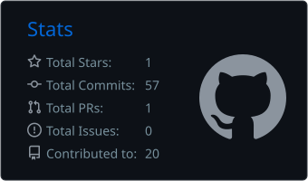
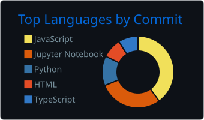

<!-- ============ HEADER ============ -->
<p align="center">
  
</p>

<p align="center">
  <a href="https://anu091104.github.io">
    
  </a>
</p>

<p align="center">
  <a href="https://anu091104.github.io"></a>
  <a href="https://www.linkedin.com/in/anushka0904/"></a>
  <a href="mailto:anushkasri0904@gmail.com"></a>
  <a href="https://anu091104.github.io/resume.pdf"></a>
</p>

   <p align="center">
     🌐 <b>Portfolio:</b> <a href="https://anu091104.github.io"><b>anu091104.github.io</b></a>
   </p>

---

### 👩‍💻 About Me

```python
class Anushka:
    role      = "B.Tech CSE (AI/ML) — Manipal University Jaipur, class of 2027"
    gpa       = "8.73 / 10  •  Dean's List"
    focus     = ["Backend Engineering", "Data Pipelines", "Applied ML"]
    currently = "Research Contributor — climate-aware AI system, MUJ R&D Cell"
    certified = ["Red Hat RH124/RH134", "Azure AI/ML Fundamentals", "Oracle SQL"]
    open_to   = "SDE / Backend / Full-Stack / ML / Data roles"
```

---

### 💼 Experience

| Role | Organisation | Highlights |
|---|---|---|
| **Research Contributor (AI/ML)** | R&D Cell, Manipal University Jaipur<br><sub>Jan 2026 – Present</sub> | Climate-aware AI system fusing satellite, weather & soil data (**100K+ observations**); built **5+ stage** automated ML workflows for geospatial & time-series data |
| **Analytics & Insights Intern** | Titan Company — Watches Division<br><sub>Jun – Jul 2026</sub> | Python scraping pipelines validating **2,000+ listings** across Amazon, Flipkart & Myntra (**34 brands**); competitor benchmarking across **40+ parameters** |
| **Backend Development Intern** | TechLearn Solutions<br><sub>Mar – May 2026</sub> | **10+ REST endpoints** in Node.js / Express / MongoDB for assessments, RBAC & college management; indexed schemas with pagination |

---

### 🚀 Featured Projects

<table>
<tr>
<td width="50%" valign="top">

#### 🛰️ [API Sentinel](https://github.com/anu091104/Api-sentinel-version2)
Real-time API reliability monitor. A scheduler pings every endpoint each 60 s and the dashboard shows live status, 24-h uptime, failure rate and latency trends.


[**Live demo →**](https://api-sentinel-version2.vercel.app/) &nbsp;•&nbsp; [Code](https://github.com/anu091104/Api-sentinel-version2)

</td>
<td width="50%" valign="top">

#### 🔎 [RepoLens](https://github.com/anu091104/Github-Repo-Explainer)
Paste any public GitHub repo and get an AI-generated brief: purpose, architecture, detected tech stack, how to run it, and likely interview questions.


[Code](https://github.com/anu091104/Github-Repo-Explainer)

</td>
</tr>
<tr>
<td width="50%" valign="top">

#### 🧵 [CraftMatch](https://github.com/aayushisabharwal/GenAi-Exchange-Hackathon-)
Two-sided platform matching artisans with businesses, scoring on location, preferences and performance. *Team project, GenAI Exchange Hackathon.*


</td>
<td width="50%" valign="top">

#### 📦 Retail Inventory Optimization
30-day demand forecasting with Prophet, automated EOQ & safety-stock calculation, and price-sensitivity models in an interactive Streamlit app.


</td>
</tr>
</table>

**More work:** 📈 **Stock Sentiment Analysis** — TextBlob sentiment features + Random Forest, evaluated with ROC &nbsp;•&nbsp; 💰 **Expense Tracker** — Flask REST APIs with MongoDB aggregation insights

<p align="center"><a href="https://anu091104.github.io/#projects"><b>See everything on my portfolio →</b></a></p>

---

### 🛠️ Tech Stack

**Languages**
<p>
  
</p>

**Backend & Databases**
<p>
  
</p>

**Frontend**
<p>
  
</p>

**ML / AI**
<p>
  
</p>

**DevOps & Tools**
<p>
  
</p>

<sub>Also: Pandas • NumPy • Matplotlib • Prophet • Streamlit • SQLAlchemy • Gemini API • REST APIs • JWT / RBAC</sub>

---

### 📊 GitHub Activity

<!-- These images are generated inside this repo by .github/workflows/profile-stats.yml.
     Run that workflow once from the Actions tab and they appear. -->
<p align="center">
  
  
</p>

<p align="center">
  <picture>
    <source media="(prefers-color-scheme: dark)" srcset="https://raw.githubusercontent.com/anu091104/anu091104/output/github-snake-dark.svg"/>
    
  </picture>
</p>

<!-- ============ FOOTER ============ -->
<p align="center">
  
</p>
